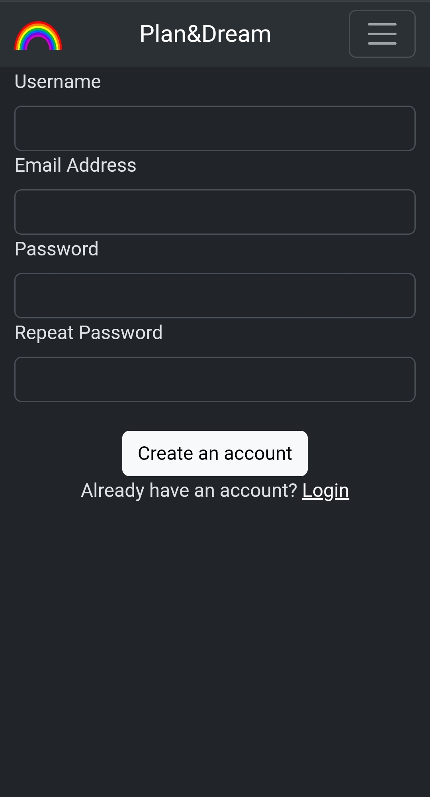
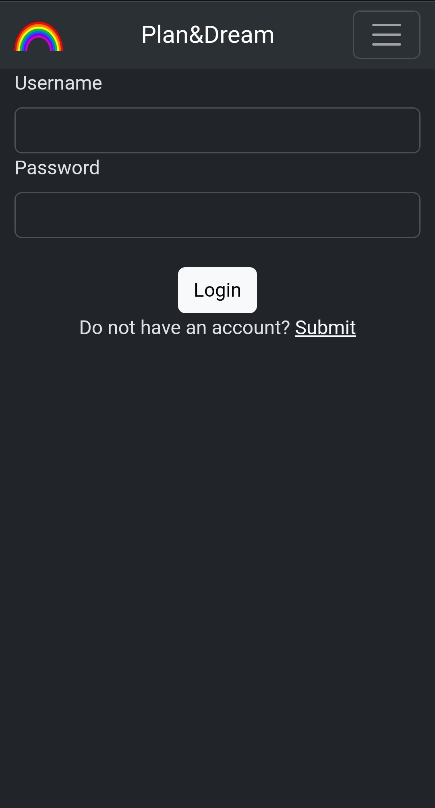
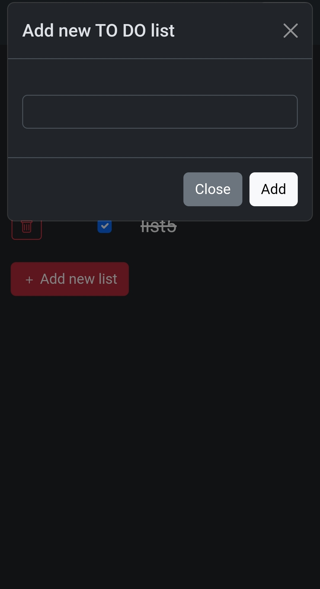
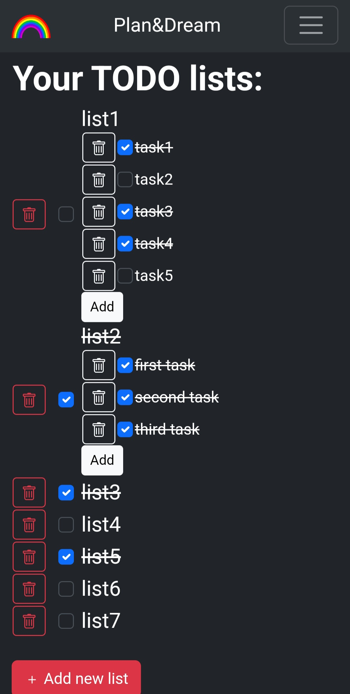

# Plan&Dream Web App
## Table of contents: 
* [General info](#general-info)
* [Usage](#usage)
* [App functionalities](#app-functionalities)
* [Project structure](#project-structure)
* [Requirements](#requirements)
* [Used technologies](#used-technologies)
* [Setup](#setup)
* [App starting](#app-starting)

### General info
The aim of this project is to create a web application using Flask that allows users to create their own "to-do lists".
This project focuses mainly on developing skills connected with Flask and JavaScript as well as good practices while creating project structure.
### Usage
After starting the application, you can interact with it through the web interface:

- **Registration**: Create a new account to start using the app.
- **Login**: Access your account using your credentials.
- **Manage To-Do Lists**: Add, delete lists and tasks in your lists.
- **Crossing Out Tasks**: Mark tasks as completed by crossing them out.
### App functionalities
Click the picture to see the video.
<table>
  <tr>
    <td>
      <p><strong>Registration:</strong> Registration process.</p>
      <a href="media/registration.mp4">
        
      </a>
    </td>
    <td>
      <p><strong>Login:</strong> Login process and error handling.</p>
      <a href="media/logout_login.mp4">
        
      </a>
    </td>
  </tr>
  <tr>
    <td>
      <p><strong>Add:</strong> Adding and deleting process.</p>
      <a href="media/delete_add.mp4">
        
      </a>
    </td>
    <td>
      <p><strong>Cross:</strong> Crossing out process.</p>
      <a href="media/crossing_out.mp4">
        
      </a>
    </td>
  </tr>
</table>
All recordings are recordings from a mobile browser as the web app runs also on mobile devices.

### Requirements
* requirements.txt contains a list of packages or libraries needed to work on this project.
### Used technologies
* Database: SQLAlchemy for ORM and database management.
* Back-End: Python 3.11+ for server-side logic and application functionality.
* Front-End:
  * JavaScript for interactive features.
  * CSS for styling and layout.
  * HTML for content structure.
* Front-End Framework: Bootstrap v5.3 for responsive design and UI components
### Project structure
```
├── app/
│   ├── blueprints/ - All blueprints for the app.
│   │   ├── auth/
│   │   │   ├── login/
│   │   │   ├── register/
│   │   ├── db_models/ - Defines blueprints for interacting with the database.
│   │   │   ├── lists/
│   │   │   ├── things_to_do/
│   │   │   └── users/
│   │   ├── home/
│   │   └── user_page/
│   ├── cli/ - Cli commands connected with database config and seeding.
│   ├── static/ - Base static files. 
│   └── templates/ - Base template.
├── database/ - SQL Alchemy database, models and schemas
├── configuration.py - Contains all configuration settings for the application.
├── requirements.txt - Development dependencies.
├── RunApp.bat - A batch script to start the application.
└── VenvSetUp.bat - A batch script to set up the virtual environment for the project.
```
### Setup
1. First, clone this repository.
   ```sh
   git clone https://github.com/natix-x/Plan-And-Dream-Web-App.git
   ```
2. Then, activate the environment.
    ```sh
   VenvSetUp.bat
   ```
### App starting
1. Run application.
   ```sh
   RunApp
   ```
2. To see application access below url in your browser.
   ```
   http://127.0.0.1:5000
   ```
   If you want to change host or port [click here](configuration.py).

